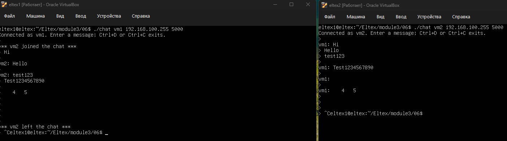
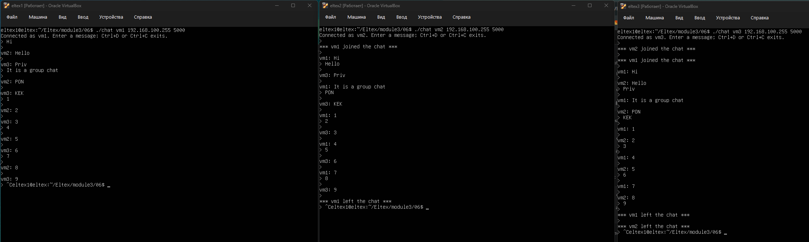

## Запуск

```bash
./chat NAME [BROADCAST_ADDRESS [PORT]]
```

По умолчанию используются адрес `255.255.255.255` и порт `5000`. Например,
два клиента в одной сети можно запустить так:

```bash
./chat vm1 192.168.1.255 5000
./chat vm2 192.168.1.255 5000
./chat vm3 192.168.1.255 5000
```

### Пример работы:


